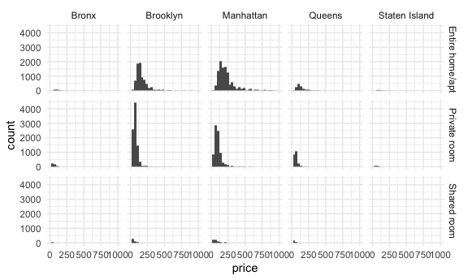
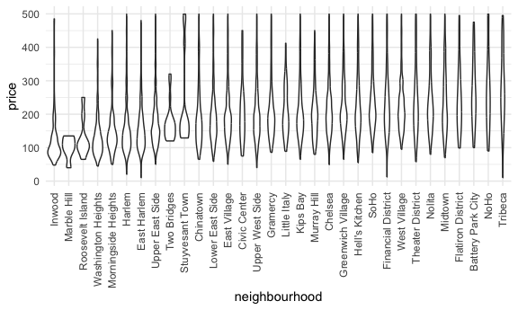

Case Study
================

Load key packages.

``` r
library(p8105.datasets)

data(nyc_airbnb)
```

## Brainstorm questions

- Pick a neighborhood / borough, investigate price
  - If we had dates, does that affect price?
- Does the type of unit affect rating / price?
- What about ZIP codes?
- What rental has the highest reviews?
- Are there any connections between price and other variables?
- What about prices over time?
  - Could we look at prices before and after the pandemic?
- How else did the pandemic affect AirBNB in NYC?
- Does the name of the rental affect the price / rating?
- What does the number of days available have to do with anything else?

Let’s look at prices first

``` r
nyc_airbnb |> 
  drop_na(price) |> 
  group_by(neighbourhood_group) |> 
  summarize(
    mean_price = mean(price),
    min_price = min(price),
    max_price = max(price)
  )
```

    ## # A tibble: 5 × 4
    ##   neighbourhood_group mean_price min_price max_price
    ##   <chr>                    <dbl>     <dbl>     <dbl>
    ## 1 Bronx                     82.8        20       862
    ## 2 Brooklyn                 120.         10     10000
    ## 3 Manhattan                180.         10      9999
    ## 4 Queens                    94.7        12      6050
    ## 5 Staten Island            128.         22      5000

What about room type in a given neighborhood?

``` r
nyc_airbnb |> 
  drop_na(price) |> 
  group_by(room_type,neighbourhood_group) |> 
  summarize(
    mean_price = mean(price)
  ) |> 
  pivot_wider(
    names_from = room_type,
    values_from = mean_price
  )
```

    ## `summarise()` has grouped output by 'room_type'. You can override using the
    ## `.groups` argument.

    ## # A tibble: 5 × 4
    ##   neighbourhood_group `Entire home/apt` `Private room` `Shared room`
    ##   <chr>                           <dbl>          <dbl>         <dbl>
    ## 1 Bronx                            125.           65.5          57.5
    ## 2 Brooklyn                         175.           76.7          59.6
    ## 3 Manhattan                        238.          107.           84.7
    ## 4 Queens                           140.           70.6          49.1
    ## 5 Staten Island                    207.           65.4          25

``` r
nyc_airbnb |> 
  count(neighbourhood_group, room_type)
```

    ## # A tibble: 15 × 3
    ##    neighbourhood_group room_type           n
    ##    <chr>               <chr>           <int>
    ##  1 Bronx               Entire home/apt   192
    ##  2 Bronx               Private room      429
    ##  3 Bronx               Shared room        28
    ##  4 Brooklyn            Entire home/apt  7427
    ##  5 Brooklyn            Private room     9000
    ##  6 Brooklyn            Shared room       383
    ##  7 Manhattan           Entire home/apt 10814
    ##  8 Manhattan           Private room     7812
    ##  9 Manhattan           Shared room       586
    ## 10 Queens              Entire home/apt  1388
    ## 11 Queens              Private room     2241
    ## 12 Queens              Shared room       192
    ## 13 Staten Island       Entire home/apt   116
    ## 14 Staten Island       Private room      144
    ## 15 Staten Island       Shared room         1

Make some plots

``` r
nyc_airbnb |> 
  ggplot(aes(x = price)) + 
  geom_histogram() +
  facet_grid(room_type ~ neighbourhood_group)+
  scale_x_continuous(limits = c(0, 1000))
```

    ## `stat_bin()` using `bins = 30`. Pick better value `binwidth`.



``` r
nyc_airbnb |> 
  filter(
    neighbourhood_group == "Manhattan",
    price < 500, 
    room_type == "Entire home/apt") |> 
  mutate(neighbourhood = fct_reorder(neighbourhood, price)) |> 
  ggplot(aes(x = neighbourhood, y = price)) +
  geom_violin() +
  theme(axis.text.x = element_text(angle = 90, hjust = 1, vjust = 0.5))
```



(remember to look at extreme values …)

``` r
nyc_airbnb |> 
  filter(price > 9000)
```

    ## # A tibble: 6 × 17
    ##         id review_scores_location name     host_id host_name neighbourhood_group
    ##      <dbl>                  <dbl> <chr>      <dbl> <chr>     <chr>              
    ## 1  3103784                     10 A Priva…  9.83e6 Michael   Brooklyn           
    ## 2  4737930                      8 Spanish…  1.24e6 Olson     Manhattan          
    ## 3   187529                     NA $3200/m…  9.02e5 Georgia   Manhattan          
    ## 4  9528920                      9 Quiet, …  3.91e6 Amy       Manhattan          
    ## 5 16429718                     NA Charmin…  1.36e7 Lena      Brooklyn           
    ## 6 12955683                      8 Great l…  3.57e7 Duan      Manhattan          
    ## # ℹ 11 more variables: neighbourhood <chr>, lat <dbl>, long <dbl>,
    ## #   room_type <chr>, price <dbl>, minimum_nights <dbl>,
    ## #   number_of_reviews <dbl>, last_review <date>, reviews_per_month <dbl>,
    ## #   calculated_host_listings_count <dbl>, availability_365 <dbl>

``` r
nyc_airbnb |> 
  filter(calculated_host_listings_count > 30)
```

    ## # A tibble: 68 × 17
    ##          id review_scores_location name    host_id host_name neighbourhood_group
    ##       <dbl>                  <dbl> <chr>     <dbl> <chr>     <chr>              
    ##  1 15057686                     NA Home 4…  2.64e7 Stat      Brooklyn           
    ##  2 15080936                     NA Home 4…  2.64e7 Stat      Brooklyn           
    ##  3 14776203                     10 Home 4…  2.64e7 Stat      Brooklyn           
    ##  4 15074005                     NA Home 4…  2.64e7 Stat      Brooklyn           
    ##  5  5866656                     NA Home 4…  2.64e7 Stat      Brooklyn           
    ##  6  5538353                     NA Home 4…  2.64e7 Stat      Brooklyn           
    ##  7  5632551                     10 Home 4…  2.64e7 Stat      Brooklyn           
    ##  8  7788565                     NA Home 4…  2.64e7 Stat      Brooklyn           
    ##  9  7789408                      9 Home4 …  2.64e7 Stat      Brooklyn           
    ## 10  7789213                     10 Home 4…  2.64e7 Stat      Brooklyn           
    ## # ℹ 58 more rows
    ## # ℹ 11 more variables: neighbourhood <chr>, lat <dbl>, long <dbl>,
    ## #   room_type <chr>, price <dbl>, minimum_nights <dbl>,
    ## #   number_of_reviews <dbl>, last_review <date>, reviews_per_month <dbl>,
    ## #   calculated_host_listings_count <dbl>, availability_365 <dbl>

Keep looking at location

``` r
nyc_airbnb |> 
  filter(
    neighbourhood_group == "Manhattan",
    price < 1000, 
    room_type == "Entire home/apt") |> 
  ggplot(aes(x = lat, y = long, color = review_scores_location)) + 
  geom_point()
```


